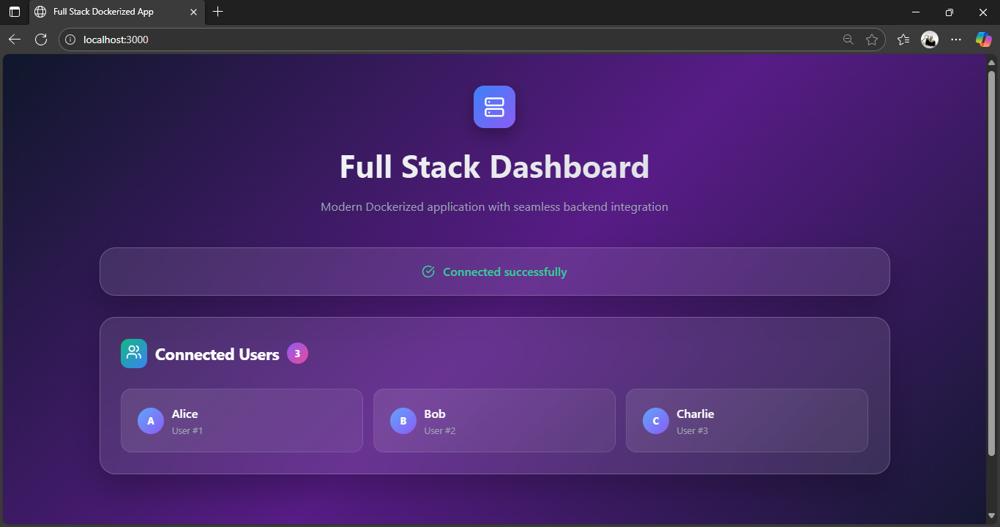
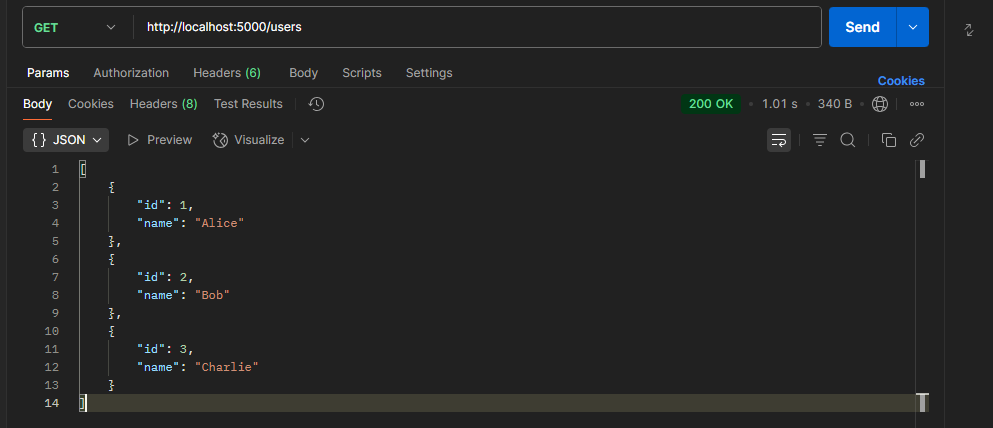
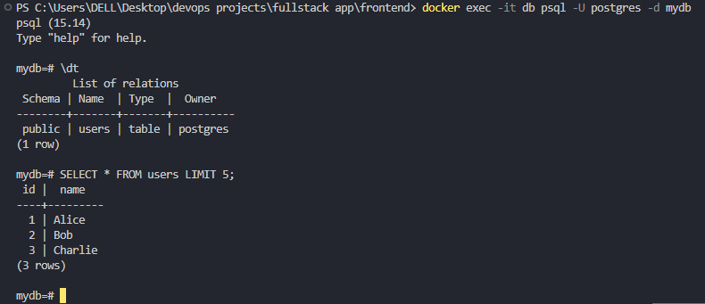
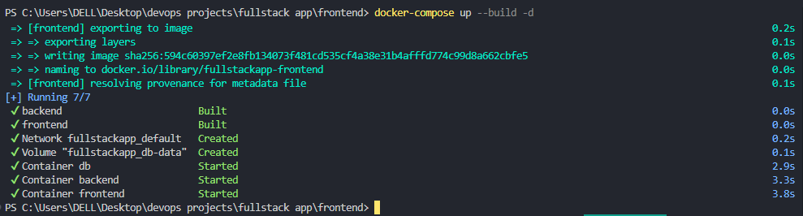

# Full-Stack Application with Docker Compose


## 📌 Overview

This project demonstrates a **containerized full-stack application** with:

- **Frontend**: React (served via Nginx container)  
- **Backend**: Node.js/Express API  
- **Database**: PostgreSQL with initialization script  

The entire stack runs seamlessly with **Docker Compose**, allowing easy setup and consistent local development.

---

## 🚀 Features

- **Frontend (React)**: User-facing interface  
- **Backend (Node.js/Express)**: REST API that connects frontend to the database  
- **Database (Postgres)**: Persistent data storage with initialization via `init.sql`  
- **Dockerized Services**: Each service runs in its own isolated container  
- **One Command Setup**: Launches the entire stack with `docker-compose up`  

---

## ⚙️ Technologies Used

- **React 18** – Frontend UI  
- **Node.js / Express** – Backend REST API  
- **PostgreSQL 15 (Alpine)** – Database  
- **Docker & Docker Compose** – Containerization and orchestration  

---

## 📁 Project Structure

```bash
fullstack-docker-app/
├── images/                # Readme assets
├── backend/               # Node backend service
│   ├── Dockerfile
│   ├── package.json
│   └── server.js
├── frontend/              # React frontend service
│   ├── Dockerfile
│   ├── package.json
│   ├── public/...
│   └── src/...
├── init.sql               # Database initialization script
├── docker-compose.yml     # Orchestrates full stack
└── README.md
````

---

## 🔧 Setup Instructions

1. **Clone the repository**

   ```bash
   git clone https://github.com/your-username/fullstack-docker-app.git
   cd fullstack-docker-app
   ```

2. **Build and run the services**

   ```bash
   docker-compose up --build
   ```

3. **Access the services**

   * Frontend → [http://localhost:3000](http://localhost:3000)
   * Backend API → [http://localhost:5000](http://localhost:5000)
   * PostgreSQL → available on port **5432**

---

## 📸 Visuals

* **Frontend Running in Browser**
  

* **Backend API Response**
  

* **Database Connection (Postgres CLI with Sample Data)**
  

* **Docker Compose CLI**
  

---

## 📈 How It Works

1. React frontend makes requests to the Node backend
2. Backend communicates with PostgreSQL
3. PostgreSQL is initialized via `init.sql` at container startup
4. All services are orchestrated with Docker Compose

---

## 🤝 Contributing

Contributions are welcome! Fork the repo, create a feature branch, and submit a pull request.
